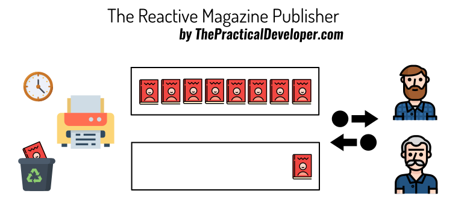

# Reactive Book / Java 9's Flow API

## Description

This is a simple project that shows how to use Java 9's Flow API to create a Reactive Programming example. It's based on a story: a Magazine Publisher with two different Subscribers, one of them being too slow to pick items. 

This is part of a book that's it currently in progress. If you want early access to it, subscribe to the mailing list at [LeanPub: Reactive Programming with Java and Spring](https://leanpub.com/reactive-programming)

The guide [Reactive Programming with Java 9 Flow](https://thepracticaldeveloper.com/2018/01/31/reactive-programming-java-9-flow/) explains this code and the fictional use case with detail.

## Code Structure

* `ReactiveFlowApp` creates a Publisher using Java 9's `SubmissionPublisher`. It implements backpressure and dropping of items by setting a timeout for subscribers.
* `MagazineSubscriber` implements `Flow.Subscriber` and let you experiment what happens when subscribers are slow.
* `FlexibleProcessor` implements `Flow.Processor` and acts like a generic Publisher and Subscriber that can be placed in between others to transform and/or filter data.
* `ColorConsoleAppender` has nothing to do with Java 9 or reactive programming, is just a utility class to set colors to log messages so the result can be understood easier.

## Feedback and Contribution

If you find something wrong, feel free to create an issue. Same if you have questions.
